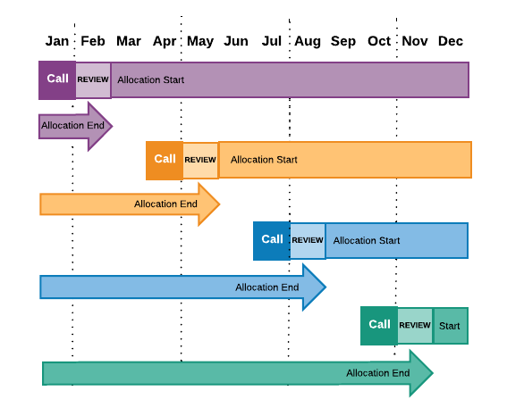
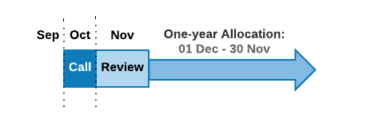

[//]: <> (REMOVE ME IF PAGE VALIDATED)
[//]: <> (vvvvvvvvvvvvvvvvvvvv)
!!! warning
    This page has been automatically migrated and may contain formatting errors.
[//]: <> (^^^^^^^^^^^^^^^^^^^^)
[//]: <> (REMOVE ME IF PAGE VALIDATED)

Applications for new allocations on existing projects are accepted and
assessed in quarterly allocation periods. Under this quarterly call
schedule, applications for new allocations on existing projects are due
in the following months:

-   April (for allocations starting 1 June)
-   July (for allocations starting 1 September)
-   October (for allocations starting 1 December)
-   January (for allocations starting 1 March)

Requests will be reviewed in the month following the call period and
researchers will be notified by the third Monday of that month.
Allocations will start on the first day of the next month and run for
one year. The diagram below illustrates how these quarterly call periods
are scheduled during the year:

For example, if you apply for a new allocation on your existing project
in the month of October, we will review your application in October or
early November, you will be notified of your allocation by the end of
November, and your allocation will start on 1 December (as shown in the
graphic below).

## Existing allocations

If you have an existing allocation, you will be reminded about the
upcoming call by email during the second month before your project
expires. For example, if your allocation expires at the end of May, you
will receive email reminders during the month of April.

We aggregate requests and deal with them in batches during the review
month.

-   If you apply for your new allocation early (for example, you apply
in February when your allocation isn’t due to end until the end of
May), we will hold your request until April.
-   If you apply for your new allocation late, your request may be
deprioritised by your institution, or you may suffer an interruption
to service as we have to consider your request separately and later.
It is possible, depending on overall demand, that you may have to
wait for the following call before your request is considered.

If you have questions about the review cycles or other steps involved
with getting access to NeSI, contact <support@nesi.org.nz>.