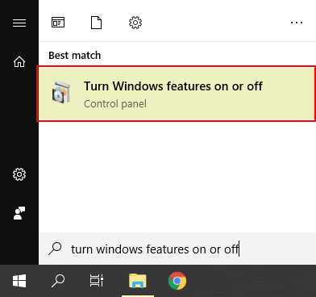
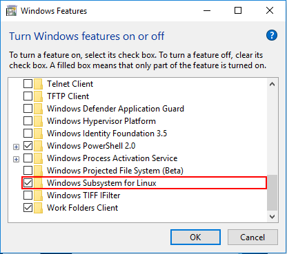

[//]: <> (REMOVE ME IF PAGE VALIDATED)
[//]: <> (vvvvvvvvvvvvvvvvvvvv)
!!! warning
    This page has been automatically migrated and may contain formatting errors.
[//]: <> (^^^^^^^^^^^^^^^^^^^^)
[//]: <> (REMOVE ME IF PAGE VALIDATED)

!!! prerequisite Requirements
-   Windows 10.

Windows subsystem for Linux is a feature that allows you to utilise some
linux commands and command line tools.

WSL is enabled by default on later versions of Windows 10.
!!! prerequisite Tip
You can test whether WSL is installed by opening 'Windows PowerShell'
and typing `wsl`.

## Enabling WSL

1.  Open 'Turn Windows features on or off'

2.  Scroll down and tick the 'Windows Subsystem for Linux' option.

Click OK
3.  Wait for the installation to finish then restart your computer.
!!! prerequisite What Next?
-   Set up your [SSH config
file](https://support.nesi.org.nz/hc/en-gb/articles/360000625535).